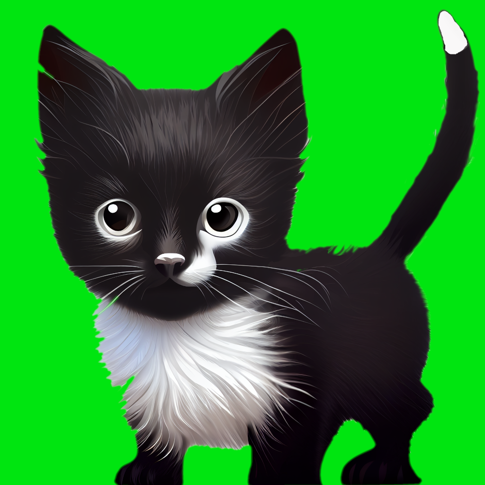

<!-- PROJECT SHIELDS -->
[![Contributors][contributors-shield]][contributors-url]
[![Forks][forks-shield]][forks-url]
[![Stargazers][stars-shield]][stars-url]
[![Issues][issues-shield]][issues-url]

<!-- PROJECT LOGO -->
 

  

<h3 align="center">Tippers</h3>

  

    An opinionated tip calculator using fuzzy logic.
     
  

<!-- TABLE OF CONTENTS -->

  
Table of Contents

  <ol>
    <li>
      <a href="#about-the-project">About The Project</a>
      <ul>
        <li><a href="#built-with">Built With</a></li>
      </ul>
    </li>
    <li>
      <a href="#getting-started">Getting Started</a>
    </li>
    <li><a href="#license">License</a></li>
    <li><a href="#contact">Contact</a></li>
  </ol>

<!-- ABOUT THE PROJECT -->
## About The Project

[![Product Name Screen Shot][product-screenshot]](https://example.com)

Tippers aims to be an easy to use tipping app which uses fuzzy logic behind the
scenes to arrive at a fair tip. Three aspects of the service are ranked and then
a tip is calculated using fuzzy logic.

(<a href="#readme-top">back to top</a>)

### Built With

* F#
* Fabulous
* [![Xamarin][Xamarin]][Xamarin-url]
* Dot Net
* 

(<a href="#readme-top">back to top</a>)

<!-- GETTING STARTED -->
## Getting Started

(<a href="#readme-top">back to top</a>)

<!-- LICENSE -->
## License

(<a href="#readme-top">back to top</a>)

<!-- CONTACT -->
## Contact
Project Link: [https://github.com/smithandrewl/tippers](https://github.com/smithandrewl/tippers)

(<a href="#readme-top">back to top</a>)

<!-- MARKDOWN LINKS & IMAGES -->
<!-- https://www.markdownguide.org/basic-syntax/#reference-style-links -->

[contributors-shield]: https://img.shields.io/github/contributors/smithandrewl/tippers.svg?style=for-the-badge
[contributors-url]: https://github.com/smithandrewl/tippers/graphs/contributors
[forks-shield]: https://img.shields.io/github/forks/smithandrewl/tippers.svg?style=for-the-badge
[forks-url]: https://github.com/smithandrewl/tippers/network/members
[stars-shield]: https://img.shields.io/github/stars/smithandrewl/tippers.svg?style=for-the-badge
[stars-url]: https://github.com/smithandrewl/tippers/stargazers
[issues-shield]: https://img.shields.io/github/issues/smithandrewl/tippers.svg?style=for-the-badge
[issues-url]: https://github.com/smithandrewl/tippers/issues
[product-screenshot]: images/screenshot.png

[Xamarin]: https://img.shields.io/badge/Xamarin-3498DB?style=for-the-badge&logo=xamarin&logoColor=white
[Xamarin-url]: https://dotnet.microsoft.com/en-us/apps/xamarin
